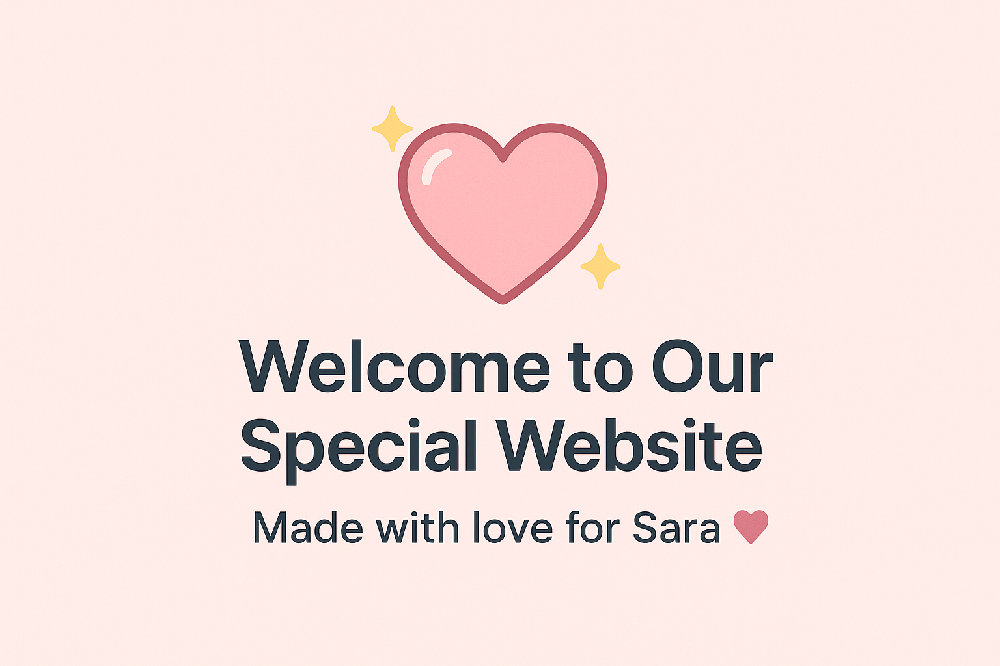

💖 Welcome to our Special Website 💖
This adorable little corner of the internet is dedicated to the amazing Sara. 
🌸 It's a playful and loving way to remind her how much she means to someone very special.

How It Works
When you visit the website, you'll be greeted with a heartfelt question:

"Sara, do you know I love you?"

You have two options to respond:
If you click "No":
The button will playfully jump to a random place on the screen, making it impossible to click. 😜
It's a fun little game to remind Sara that the love is undeniable and she can't escape it!
If you click "Yes":

You'll be taken to a lovely page that reassures you with the message:
"You're always right!" 🌟
This is a sweet affirmation of the wonderful bond you share.
Why This Website?
This site was created with lots of love and care to bring a smile to Sara's face. It's a digital hug, a playful tease, and a loving reminder all wrapped into one. 💌

Tech Specs
Built With: Pure HTML, CSS, and a sprinkle of JavaScript magic ✨
Design: Simple, clean.
To Sara 💖

Enjoy the website!

Feel free to reach out if you have any questions or want to share a smile.

P.S. Have fun trying to catch that "No" button! 🎉
